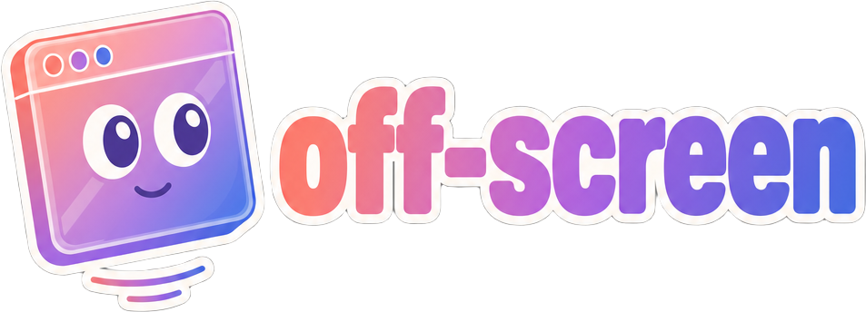

<div align="center">



### A transparent, always-on-top, click-through window mirror for macOS.

Pick any window. Crop a region. Float it anywhere — at any opacity — while you keep working underneath.

[](https://github.com/ShunL12324/off-screen/releases)
[](https://github.com/ShunL12324/off-screen/actions)
[](https://github.com/ShunL12324/off-screen/releases)
[](https://www.apple.com/macos/)
[](LICENSE)

[Download](https://github.com/ShunL12324/off-screen/releases/latest) · [Report a bug](https://github.com/ShunL12324/off-screen/issues) · [Suggest a feature](https://github.com/ShunL12324/off-screen/issues/new)

</div>

---

## Why

macOS won't let you make another app's window transparent. The system PiP only works for video. Stage Manager dims windows but doesn't shrink them. Every Apple-blessed window control is ergonomic for one workflow and useless for the rest.

**off-screen** sidesteps the OS by going through the front door: it asks the system screen picker for a window, mirrors a region of it into a window of its own, and gives that window every property the original was missing — adjustable opacity, click-through, always-on-top over fullscreen apps. The mirror is *your* window, so you can do anything you want with it.

## What it does

|  |  |
|---|---|
| 🪟 **Pick any window** | Native macOS picker — works against every app on your Mac. No entitlements, no SIP changes. |
| ✂️ **Crop a region** | Drag a rectangle over the source. Live pixel dimensions show as you draw. |
| 📐 **Auto-fit aspect** | Window snaps to the cropped region's ratio. No black bars, no scroll. |
| 🌫 **Variable opacity** | 20–100% on a slider. Toolbar floor at 50% so you can always recover. |
| 👻 **Click-through mode** | `⌘⇧M` — clicks fall through to whatever's underneath. Watch a stream while typing in your IDE. |
| 📌 **Floats over fullscreen** | macOS `floating` window level — survives even fullscreen apps. |
| 💾 **Persistent** | Bounds and opacity restore on relaunch. |
| ⌨️ **Global hotkeys** | Show/hide and click-through toggle work even when another app has focus. |

## Quick start

### Install

Grab the latest `.dmg` from [Releases](https://github.com/ShunL12324/off-screen/releases/latest), drag the app to `/Applications`.

> First launch: the binary is unsigned, so macOS will block it. Right-click → **Open** the first time, or run
> `xattr -cr /Applications/off-screen.app` in Terminal. After that it launches normally.

You'll also be asked once for **Screen Recording** permission — that's how the system picker works. Grant it under
*System Settings → Privacy & Security → Screen Recording*, then reopen.

### Use it

1. Click the crop icon (or use the in-app "Pick a window" button).
2. Pick a window from the macOS picker.
3. Drag a rectangle over the area you actually want.
4. Press **Enter** to confirm. Window resizes to that crop's aspect ratio.
5. Slide the opacity down. Hit `⌘⇧M`. Get back to work.

## Keyboard shortcuts

| Shortcut | Action |
|---|---|
| `⌘⇧H` | Show / hide window — **global** |
| `⌘⇧M` | Toggle click-through — **global** |
| `⌘⇧↑` / `⌘⇧↓` | Bump opacity ±5% |
| `⌘H` | Hide window (when focused) |
| `Enter` | Confirm crop selection |
| `Esc` | Discard current drag |

## Build from source

Requires Node 20+ and macOS.

```sh
git clone https://github.com/ShunL12324/off-screen
cd off-screen
npm install
npm start                # dev
npm run lint             # eslint flat config
npm run icon             # rebuild assets/icon.icns from icon-master.png
npm run dist             # produces signed-style dmg in dist/
```

Releases are cut by pushing a `vX.Y.Z` tag. The
[release workflow](.github/workflows/release.yml) builds arm64 + x64 dmgs on a
macOS runner and publishes them as a non-draft GitHub release.

```sh
git tag v0.1.3
git push --tags
```

## How it works (short)

```
┌─────────── Electron ───────────┐
│                                │
│   main.js    BrowserWindow     │   frame: false, transparent: true,
│              alwaysOnTop       │   floating level, hasShadow: false
│                  ▲             │
│                  │ IPC         │
│                  ▼             │
│   preload.js  contextBridge    │   exposes window.api to renderer
│                  ▲             │
│                  │             │
│                  ▼             │
│   renderer/  index.html  ──┐   │
│              styles.css    │   │   crop overlay, opacity, toolbar
│              renderer.js   │   │   state machine (idle/picking/active)
│              icons.js      │   │
│                            ▼   │
│              <video>  ←  getDisplayMedia({useSystemPicker:true})
│                                │   ↑ macOS shows native window picker
└────────────────────────────────┘
```

The mirror is just a `<video>` element inside an HTML container with `overflow:
hidden`. The cropped region is rendered by sizing the `<video>` to the source's
true pixel dimensions and offsetting it with negative `left`/`top` so only the
chosen rectangle falls inside the visible viewport. No canvas, no per-frame
JavaScript — the GPU does the cropping.

## Caveats

- The mirror is **read-only**. Clicks and keys land on the mirror surface, not
  on the source window. Click-through mode lets clicks reach apps *under* the
  mirror, but never the source itself.
- macOS PiP windows hosted by `com.apple.PIPAgent` (Apple's own video PiP) don't
  appear in `getDisplayMedia` — they're owned by an agent process. Apps that
  host their own floating window (Spotify mini, IINA, Douyin, etc.) work fine.
- Builds aren't notarized. macOS Gatekeeper will warn on first launch — see the
  install note above.

## License

[MIT](LICENSE) © Shun Liu

<div align="center">
<sub>If this saved you a tab, consider giving the repo a ⭐.</sub>
</div>
